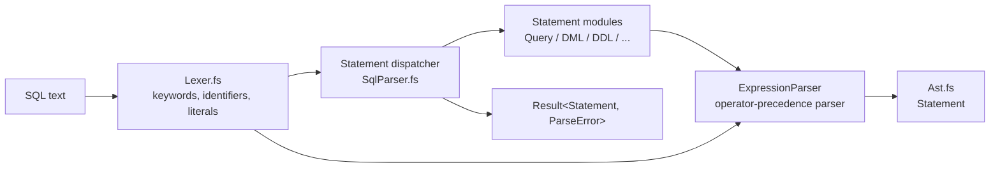

# Architecture

Design overview of the SQL parser: how the source is organised, how a statement
flows through the parsers, and which conventions the implementation follows.

---

## 1. Design principles

- **F# + [FParsec](https://www.quanttec.com/fparsec/)** — a scannerless,
  combinator-based parser. There is no separate token stream: every parser
  consumes characters and returns a value.
- **Functional-first** — recursion, immutability and composition over loops,
  mutation and statements. `[<TailCall>]` marks recursive loops to avoid stack
  overflows.
- **Grammar-faithful.** [sql-2016-grammar.txt](../sql-2016-grammar.txt) (the
  SQL-2016 foundation grammar, ISO/IEC 9075-2:2016 clause numbering) is the
  design document. Source comments cite the rule they implement as
  `// <clause> <rule name>` (e.g. `// 11.3 <table definition>`), and
  `SqlParser.Tests/RuleNumberingTests.fs` enforces that citation style. Where the
  standard is strict, the parser is strict too — see [trade-off.md](trade-off.md).
- **Parse-only.** The library produces an AST; it performs no name resolution,
  type checking or evaluation. Shape-based ambiguity between rules with identical
  syntax is therefore resolved heuristically and documented as such.
- **Errors are values.** Parsing returns `Result<'T, ParseError>`; the parser
  never throws for malformed input.

## 2. Parse pipeline

The pipeline is a single FParsec pass. Each layer is a combinator that delegates
to the layer below:

| Layer | Concern |
|-------|---------|
| `Lexer.fs` | Character-level tokens: keywords, identifiers, literals, separators, operators, delimiters. |
| `ExpressionParser.fs` | The `OperatorPrecedenceParser` (`opp`) for `<value expression>`, function calls, subqueries, and the `<data type>` family. |
| `PredicateParser.fs` | §8 `<predicate>`s — the postfix chain applied to a `<value expression primary>` plus the standalone `EXISTS`/`UNIQUE`/`JSON_EXISTS`/period predicates. |
| Statement modules | Clause and statement grammars, one module per grammar section (see §4), including user-defined types (`SchemaParser.fs`). |
| `SqlParser.fs` | Dispatches on the leading token to the statement modules and exposes the two entry points. |

`runParser` turns FParsec's `Failure` into `ParseError(message, Position)` and
`Success` into `Ok`. Both entry points consume leading whitespace and require
`eof`, so trailing garbage is an error.

## 3. Entry points

Two public functions, both requiring the trailing `<semicolon>`:

| Function | Grammar rule | Accepts |
|----------|--------------|---------|
| `SqlParser.parse` | 22.1 `<direct SQL statement>` | `<directly executable statement>` families: `<direct SQL data statement>` (searched `DELETE`, `SELECT`, `INSERT`, searched `UPDATE`, `TRUNCATE`, `MERGE`, `<temporary table declaration>`, `WITH ... <query>`), `<SQL schema statement>`, `<SQL transaction statement>`, `<SQL connection statement>`, `<SQL session statement>`. |
| `SqlParser.parseStatement` | 13.4 `<SQL procedure statement>` (superset) | Everything `parse` accepts, plus `DECLARE CURSOR` (14.1), `OPEN`/`FETCH`/`CLOSE`, `SELECT ... INTO`, `FREE`/`HOLD LOCATOR`, positioned `DELETE`/`UPDATE` (`WHERE CURRENT OF`), `CALL`/`RETURN`, `GET DIAGNOSTICS`, and all dynamic-SQL statements. |

`parse` additionally rejects the *positioned* forms of `UPDATE` (14.13) and
`DELETE` (14.8) via `pSearchedUpdateStatement` / `pSearchedDeleteStatement`,
because 22.1 only admits the searched forms. 22.1's
`<direct implementation-defined statement>` alternative is deliberately not
implemented.

Consumers that want "any supported statement" should use `parseStatement`;
`parse` is the narrower, standard-conforming entry point.

## 4. Module map

Compile order is significant in F# (define-before-use), so modules are ordered
leaf-first: shared/low-level parsers come first, the dispatcher last. The order
is fixed in `SqlParser/SqlParser.fsproj`.

| File | Grammar sections | Responsibility |
|------|------------------|----------------|
| `Ast.fs` | — | All AST types (`Statement`, `Expression`, `DataType`, …). No parsers. |
| `Lexer.fs` | §5, 10.1, 10.5 | Reserved words, whitespace/comments, identifiers, literals, operators, terminal characters, interval qualifiers, `<character set specification>`. |
| `ExpressionParser.fs` | §6, §7/§8 fragments, §10 | Operator-precedence parser, routine invocation, subqueries, row patterns, JSON functions, `<data type>` family, shared `<scope clause>`/`pMethodKind`. |
| `QueryParser.fs` | §7, 10.10 | `<query expression>`, `SELECT`, table/join references, windows, CTEs, `MATCH_RECOGNIZE`. |
| `PredicateParser.fs` | §8 | `<predicate>` postfix chain (`BETWEEN`/`IN`/`LIKE`/`SIMILAR TO`/`IS …`) and the standalone `EXISTS`/`UNIQUE`/`JSON_EXISTS`/period predicates. |
| `SchemaParser.fs` | §11 | Schema definition/manipulation (`CREATE`/`ALTER`/`DROP`) including user-defined types (`CREATE`/`ALTER TYPE`, 11.51–11.53), plus `CREATE PROCEDURE`/`FUNCTION`/`METHOD`/`TRIGGER` (11.49/11.60/11.61); `DROP ROLE` (12.6) is a branch of the `DROP` dispatcher. |
| `AccessControlParser.fs` | §12 | `GRANT`/`REVOKE` (privileges and roles) and `CREATE ROLE` (12.2–12.5, 12.7). |
| `DataManipulationParser.fs` | §14 | The whole of §14: DML (`INSERT`, `UPDATE`, `DELETE`, `MERGE`, `TRUNCATE`) plus the cursor/locator statements (`DECLARE CURSOR`, `OPEN`/`FETCH`/`CLOSE`, `SELECT ... INTO`, `<temporary table declaration>`, `USING`/`INTO` clauses). |
| `ControlParser.fs` | §16 | `CALL`, `RETURN`. |
| `TransactionParser.fs` | §17 | `START TRANSACTION`, `COMMIT`, `ROLLBACK`, `SAVEPOINT`, `SET TRANSACTION`, `SET CONSTRAINTS`. |
| `ConnectionParser.fs` | §18 | `CONNECT`, `SET CONNECTION`, `DISCONNECT`. |
| `SessionParser.fs` | §19 | `SET ROLE`, `SET SESSION`, `SET SCHEMA`, `SET TIME ZONE`, … |
| `DynamicParser.fs` | §20 | `PREPARE`, `EXECUTE`, descriptors, dynamic cursors. |
| `DiagnosticsParser.fs` | §23 | `GET DIAGNOSTICS`. |
| `SqlParser.fs` | §22 | Top-level dispatchers, forward-reference wiring, public `parse`/`parseStatement`. |

Examples of the ordering constraint: `PredicateParser.fs` (§8) needs
`ExpressionParser.pExpression`/`pJsonApiCommonSyntax` and the `pQuery` forward ref, so
it compiles after `QueryParser.fs` (§7) while keeping the file order
clause-ascending (§6 → §7 → §8 → §11). `AccessControlParser.fs` (§12) needs
`SchemaParser`'s `pSpecificRoutineDesignator` (10.6) and `pDropBehavior` (11.2), and
`DataManipulationParser.fs` owns `pInputUsingClause`/`pOutputUsingClause` because
`pOpenStatement` needs them and compiles before `DynamicParser.fs`.

## 5. Forward references and wiring

F# compiles modules in a fixed order and requires a definition before its use,
but many grammar rules are mutually recursive. The codebase resolves this with
`createParserForwardedToRef`, which yields a forwarding parser (safe to reference
immediately) plus a `…Ref` cell whose `.Value` is assigned once every participant
is defined. Most refs are private to the module that declares them; a ref that
crosses a module boundary is wired by whichever module first defines its target
(the statement-level refs in `SqlParser.fs`).

| Forward reference | Declared in | Wired to | Why |
|-------------------|-------------|----------|-----|
| `pStatement` / `pStatementRef` | `SchemaParser.fs` | the full statement `choice` (`SqlParser.fs`) | The first module that needs "any statement" — routine bodies (11.60) and triggered statements (11.49). `SqlParser.fs` reuses the same ref for `parseStatement`. |
| `pDataChangeStatementRef` | `QueryParser.fs` | `pInsertStatement` … `pMergeStatement` (`SqlParser.fs`) | `<data change delta table>` (7.6) needs the DML parsers, compiled later. |
| `pRoutineInvocation` | `ExpressionParser.fs` | the 10.4 `<routine invocation>` parser (same module) | A `<table argument>` (10.4) may be a `<table function invocation>`, i.e. a `<routine invocation>`, while a routine invocation's `<SQL argument list>` contains `<SQL argument>`s again. |
| `pPredicateRef`, `pPredicateNoBooleanTestRef`, `pBooleanTestPart2Ref`, `pWhenOperandPart2Ref`, `pPredicatePrimaryRef` | `ExpressionParser.fs` | `PredicateParser` (§8) (`SqlParser.fs`) | §6.3 `<value expression primary>` and §6.39 `<boolean test>` consume §8 before `PredicateParser.fs` is compiled. `pPredicate` is the full 8.1 suffix chain; `pPredicateNoBooleanTest` drops the 6.39 test for operands that are not `<boolean primary>`s; `pBooleanTestPart2` is the 6.39 `IS [NOT] {TRUE / FALSE / UNKNOWN}` suffix alone; `pWhenOperandPart2` carries 6.12's narrower part-2 list; `pPredicatePrimary` bundles the 8.9/8.10/8.11/8.20/8.23 atoms. |
| `pQueryRef` | `ExpressionParser.fs` | `pQueryExpression` (`QueryParser.fs`) | Scalar and quantified subqueries (6.29) need the §7 query parser. |
| `pExpression` | `ExpressionParser.fs` | `opp.ExpressionParser` | Central expression parser, used before `opp` is complete. |
| `pNonBooleanValueExpression` | `ExpressionParser.fs` | the boolean-free variant of `opp.ExpressionParser` | JSON slots and `<point in time>` (6.35) must not consume `AND`/`OR`. |
| `pDataType` | `ExpressionParser.fs` | the 6.1 `<data type>` family | `CAST`, JSON `RETURNING`, collection element types. |
| `pDatetimeValueExpression` | `ExpressionParser.fs` | the 6.35 `<datetime value expression>` | Needed by the 6.37 `<interval value expression>` alternative before it is defined. |
| `pNumericValueExpression` | `ExpressionParser.fs` | `oppNumeric.ExpressionParser` (same module) | Breaks the cycle `pValueExpressionPrimaryImpl → pArrayElementReference → pNumericValueExpression → pValueExpressionPrimary`. |
| `pMultisetValueExpression` | `ExpressionParser.fs` | post-`pValueExpressionPrimary` | 6.44 `SET (...)` is itself a `<value expression primary>`. |
| `pBooleanFactor` | `ExpressionParser.fs` | the 6.39 `<boolean factor>` | `[ NOT ] <boolean test>` is left-recursive. |
| `pRowPattern` | `ExpressionParser.fs` | 7.9 `<row pattern>` | `<row pattern>` is recursive through `<row pattern primary>`. |
| `pTableReference` | `QueryParser.fs` | 7.6 `<table reference>` | A `<table primary>` may nest a parenthesised `<joined table>`. |
| `pQueryExpressionBody` | `QueryParser.fs` | 7.17 `<query expression body>` | `UNION`/`EXCEPT` are left-recursive, and a parenthesised `<query primary>` contains a body. |
| `pGroupingElement` | `QueryParser.fs` | 7.13 `<grouping element>` | `GROUPING SETS` nests `<grouping element>`s. |
| `pJsonTableColumnsClause` / `pJsonTablePrimitiveColumnsClause`, `pJsonTablePlanPrimary`, `pJsonTablePlan` | `QueryParser.fs` | 7.11 `<JSON table>` | `JSON_TABLE` columns and plans are mutually recursive. |

**Never read `.Value` at module-initialisation time** — it holds FParsec's dummy
parser until it is assigned. Reference the forwarding *parser* instead.

## 6. AST design (`Ast.fs`)

- **One namespace, one file.** Every type lives in `namespace SqlParser` in
  `Ast.fs`, so parsers can pattern-match without opening a types module.
- **Position tracking.** `Position = { Line: int64; Column: int64 }`. `Statement`,
  `Expression` and `TableSource` each carry a `Pos` field, attached by
  `withStmtPosition` / `withExprPosition` / `withTablePosition` at the point the
  node starts. Other types are unpositioned.
- **One big recursive group.** `DataType` and `ExpressionKind` open an
  `and`-chain that includes nearly every AST type, because they reference each
  other mutually (`LockingClause` holds `Expression list`, `Expression` holds
  `DataType`, …). New types that reference `Expression` must be added *inside*
  this group with `and`.
- **Discriminated unions first.** Domain choices are modelled as DUs
  (`Query`, `TableSourceKind`, `AlterTableAction`, `SetClause`, `DmlTarget`, …)
  so consumers get exhaustiveness checking.
- **`option` vs `bool`.** An absent clause is `None`; a two-way choice with a
  required operand is often a `bool` (`true` = `CASCADE`/`ENFORCED`/`USER`,
  `false` = the opposite), matching how `<drop behavior>` and friends are
  modelled. `Option` distinguishes "absent" from "explicitly set".
- **Option fields for optional clauses.** Records such as `CreateTableStatement`
  gain `… : X option` fields rather than growing new DU cases, except when the
  alternatives are structurally different.
- **Names mirror the grammar.** Parsers are named after the non-terminals they
  implement (`pQuerySpecification`, `pValueExpressionPrimary`,
  `pRoutineInvocation`), and AST cases mirror the rule's alternatives.

> ⚠️ `Expression`, `TableSource` and `Statement` all have `Kind` + `Pos` fields.
> Unannotated record literals can be inferred to the wrong one; see
> [gotchas.md](gotchas.md).

## 7. Keywords and reserved words

- `Lexer.reservedWords` is the 5.2 `<reserved word>` set. A
  `<regular identifier>` (`pRegularIdentifier`) is rejected when it matches a
  reserved word; `<delimited identifier>` (`"…"`) and Unicode delimited
  identifiers are not.
- `pKeyword s` matches any keyword **case-insensitively**, requires a
  non-identifier character after it (so `SYSTEM` does not match `SYSTEM_TIME`),
  and consumes trailing whitespace. It works for reserved *and* non-reserved
  words — the reserved set only constrains identifiers.
- Consequence: many dispatch decisions cannot rely on reservedness. Words such as
  `TYPE`, `UNDER`, `ROUTINE`, `FINAL` and `OPTIONS` are non-reserved, so the
  parser lists alternatives in an order that keeps them apart (e.g. `ALTER TYPE`
  before `ALTER ROUTINE`, `DROP TYPE` before `DROP ROUTINE`). These orderings are
  load-bearing and recorded in [gotchas.md](gotchas.md).
- Routine invocation comes in two halves: a **whitelist** of reserved keywords the
  grammar spells as functions (`functionKeywords` / `pReservedFunctionName` —
  aggregate/window/inverse-distribution names plus built-ins without a dedicated
  parser), and non-reserved/delimited identifiers (`pRoutineName`). Reserved words
  that start dedicated constructs (`EXISTS`, `UNIQUE`, `VALUE_OF`, `PERIOD`, …) stay
  off the whitelist, so they cannot silently degrade to a generic `FunctionCall`;
  adding a reserved-name built-in requires extending it.
- Closed enumerations (diagnostics/descriptor item names, `<language name>`,
  `<parameter style>`) are parsed with explicit `choice [ pKeyword "…" ]` lists,
  never `pIdentifierRaw`, which would also accept `ALL`/`SELECT`/….

## 8. Error handling and validation

- **No exceptions for bad input.** `runParser` converts FParsec results to
  `Result<Statement, ParseError>`; `ParseError` carries the message and position.
- **Semantic guards run inside the parser** where the grammar demands more than
  syntax: `pSearchedUpdateStatement` / `pSearchedDeleteStatement` (22.1),
  `pOmittedTargetGuard` (20.25/20.27), `validateRoutine` (11.60), and the lexer's
  date/interval value checks. These use `>>=` plus `fail`, because `|>>` cannot
  fail.
- **Backtracking policy.** A `choice` alternative that has consumed input will not
  be retried by `<|>`, so optional or speculative prefixes are wrapped in
  `attempt`. Wrapping the *last* alternative of a `choice` is harmless; wrapping
  too little is a common bug — see [gotchas.md](gotchas.md).

## 9. Grammar coverage

| Section | ✅ | ◐ | ✗ | ⊘ | Total |
|---------|--:|--:|--:|--:|------:|
| §5 Lexical elements | 4 | 0 | 0 | 0 | 4 |
| §6 Scalar expressions | 45 | 0 | 0 | 0 | 45 |
| §7 Query expressions | 19 | 0 | 0 | 0 | 19 |
| §8 Predicates | 23 | 0 | 0 | 0 | 23 |
| §9 Additional common rules | 0 | 0 | 3 | 0 | 3 |
| §10 Additional common elements | 14 | 0 | 0 | 0 | 14 |
| §11 Schema definition and manipulation | 74 | 0 | 0 | 0 | 74 |
| §12 Access control | 7 | 0 | 0 | 0 | 7 |
| §13 SQL-client modules | 0 | 0 | 3 | 1 | 4 |
| §14 Data manipulation | 18 | 0 | 0 | 0 | 18 |
| §16 Control statements | 2 | 0 | 0 | 0 | 2 |
| §17 Transaction management | 8 | 0 | 0 | 0 | 8 |
| §18 Connection management | 3 | 0 | 0 | 0 | 3 |
| §19 Session management | 10 | 0 | 0 | 0 | 10 |
| §20 Dynamic SQL | 26 | 0 | 0 | 1 | 27 |
| §21 Embedded SQL | 0 | 0 | 0 | 9 | 9 |
| §22 Direct invocation of SQL | 2 | 0 | 0 | 0 | 2 |
| §23 Diagnostics management | 1 | 0 | 0 | 0 | 1 |
| **Total** | **256** | **0** | **6** | **11** | **273** |

- **Missing (✗):** §9.38/9.39/9.44 (SQL/JSON path language and datetime
  templates — heading-only sections with no `<…>` productions) and §13.1–13.3
  (SQL-client module definition; not applicable to a library).
- **N/A (⊘):** §13.4, §20.26, and all of §21 (embedded SQL host programs).
- **Over-permissive:** none recorded — accepted-but-not-standard constructs are
  limited to the deliberate deviations documented in [trade-off.md](trade-off.md)
  (semantic distinctions, e.g. interval vs datetime operands, and the opaque JSON
  path language).
- A rule name absent from the source does **not** imply it is unimplemented — it
  may be a sub-rule of a cited parent production.

## 10. Supported SQL features

### 🔍 Querying (SELECT)

- **Standard Clauses**: `SELECT` (including `DISTINCT`/`ALL`), `FROM`, `WHERE`, `GROUP BY`, `HAVING`, `WINDOW`, `ORDER BY`.
- **Advanced Clauses**: `OFFSET`, `FETCH FIRST/NEXT` (with `PERCENT` and `WITH TIES`).
- **Set Operations**: `UNION`, `INTERSECT`, `EXCEPT` (with `ALL`/`DISTINCT` and `CORRESPONDING`).
- **Window Functions**: Full support for `OVER` clauses, partition by, order by, and frame definitions (`ROWS`/`RANGE`/`GROUPS` between boundaries).
- **Common Table Expressions (CTEs)**: Support for `WITH` and `WITH RECURSIVE`, including `SEARCH`/`CYCLE`.
- **Row Value Constructors**: `(e1, e2, ...)` and `ROW(e1, ...)` as expressions, so row comparisons (`(a, b) = (c, d)`) and row `IN` lists work.
- **Select List**: `*`, `t.*`, `t.* AS (cols)`, and the general `<all fields reference>` (`(a + b).*`, `f(x).* AS (cols)`).
- **Table References**: `ONLY ( t ) [ AS alias [ (cols) ] ]`, `FOR SYSTEM_TIME AS OF | BETWEEN [SYMMETRIC|ASYMMETRIC] ... AND ... | FROM ... TO ...` (point-in-time expressions support `+`/`-` with intervals and `AT TIME ZONE`), `UNNEST ... [WITH ORDINALITY]`, `TABLE (...)`, `LATERAL (...)`, `TABLESAMPLE`, data-change delta tables (`FINAL|NEW|OLD TABLE ( <dml statement> ) [ AS alias [ (cols) ] ]`), `JSON_TABLE ( <JSON API common syntax> COLUMNS ( ... ) [PLAN ...] [ERROR|EMPTY ON ERROR] )` (plus its `<JSON table primitive>` form), and `MATCH_RECOGNIZE`.

### 📝 Data Manipulation (DML)

- `INSERT INTO ... VALUES / SELECT / DEFAULT VALUES`
- `UPDATE [ <table> ] ... SET ... WHERE`, including `WHERE CURRENT OF <cursor>` (positioned and preparable-dynamic variants).
- `DELETE [ FROM <table> ] ... WHERE`, including `WHERE CURRENT OF <cursor>` (positioned and preparable-dynamic variants).
- `MERGE INTO ... USING ... ON ...`
- `TRUNCATE TABLE`
- `<target table>` accepts `ONLY ( <table> )`: `UPDATE ONLY (t) ...`, `DELETE FROM ONLY (t) ...`, `MERGE INTO ONLY (t) ...`.
- `FOR PORTION OF <period> FROM <point in time> TO <point in time>` for `UPDATE` / `DELETE`.

### ↕️ Cursors & Locators

- `DECLARE <cursor> [SENSITIVE|INSENSITIVE|ASENSITIVE] [SCROLL|NO SCROLL] CURSOR [WITH|WITHOUT HOLD] [WITH|WITHOUT RETURN] FOR <query expression> [FOR READ ONLY | FOR UPDATE [OF <columns>]]`.
- Dynamic cursors: `DECLARE <cursor> [<cursor properties>] FOR <statement name>`, `ALLOCATE <extended cursor name> [<cursor properties>] FOR <extended statement name>`, `ALLOCATE <cursor name> [CURSOR] FOR PROCEDURE <specific routine designator>`.
- `OPEN <cursor> [USING <args> | USING [SQL] DESCRIPTOR <descriptor>]`, `FETCH` (with `NEXT`/`PRIOR`/`FIRST`/`LAST`/`ABSOLUTE`/`RELATIVE`) `<cursor> INTO <args> | INTO [SQL] DESCRIPTOR <descriptor>`, `CLOSE`.
- `SELECT ... INTO ...` (single row).
- `DECLARE LOCAL TEMPORARY TABLE ... [ON COMMIT PRESERVE|DELETE ROWS]`.
- `FREE LOCATOR` / `HOLD LOCATOR`.
- Routine parameter defaults accept `DESCRIPTOR ( <column name> [ <data type> ] , ... )`.

### 🏗️ Data Definition (DDL)

- `CREATE TABLE` — `<table scope>` (`GLOBAL`/`LOCAL TEMPORARY`), typed tables (`OF <udt> [UNDER <supertable>] [ ( <typed table element>... ) ]`), `<like clause>` (`LIKE <table> [INCLUDING|EXCLUDING IDENTITY|DEFAULTS|GENERATED]`), table period elements (`PERIOD FOR SYSTEM_TIME | <name> (begin, end)`), `WITH SYSTEM VERSIONING`, `ON COMMIT PRESERVE|DELETE ROWS`, and `<as subquery clause>` (`AS <query> WITH [NO] DATA`).
- Typed table elements: `<column> WITH OPTIONS [SCOPE <table>] [DEFAULT <value>] [<column constraint>...]`, `REF IS <column> [SYSTEM GENERATED|USER GENERATED|DERIVED]`, and table constraints.
- Column definitions: data types and domain names; `<default clause>` restricted to the grammar's `<default option>` (`<literal>`, datetime value functions, `USER`/`CURRENT_USER`/…, `NULL`, `ARRAY[]`/`MULTISET[]`); `GENERATED {ALWAYS|BY DEFAULT} AS IDENTITY [(options)]`; generated columns (`GENERATED ALWAYS AS (expr)`); `GENERATED ALWAYS AS ROW START|END`; `CONSTRAINT <name> <column constraint> [<constraint characteristics>]`; and a column `COLLATE` clause.
- Table constraints: `PRIMARY KEY (...)`, `UNIQUE (...)`, `FOREIGN KEY (...) REFERENCES ... [ON UPDATE|ON DELETE ...]`, `CHECK (...)` — each with an optional `CONSTRAINT <name>` and `[<constraint characteristics>]` (`INITIALLY DEFERRED|IMMEDIATE`, `[NOT] DEFERRABLE`, `[NOT] ENFORCED`).
- `CREATE VIEW` — `CREATE [RECURSIVE] VIEW`, view column list, `OF <udt> [UNDER <table>] [ ( <view element>... ) ]` (`REF IS <column> [...]` or `<column> WITH OPTIONS SCOPE <table>`), and `WITH [CASCADED|LOCAL] CHECK OPTION`.
- `CREATE SCHEMA` (character set / path, nested schema elements), `CREATE DOMAIN` / `ALTER DOMAIN` / `DROP DOMAIN`, `CREATE CHARACTER SET`, `CREATE COLLATION`, `CREATE TRANSLATION` / `DROP TRANSLATION`, `CREATE ASSERTION` / `DROP ASSERTION`.
- `CREATE CAST` / `DROP CAST`, `CREATE ORDERING` / `DROP ORDERING`, `CREATE TRANSFORM` / `ALTER TRANSFORM` / `DROP TRANSFORM`, `CREATE TYPE` / `ALTER TYPE` / `DROP TYPE` (with attributes, methods, `REF`/`CAST` options).
- `CREATE SEQUENCE` / `ALTER SEQUENCE` / `DROP SEQUENCE`; `CREATE PROCEDURE` / `CREATE FUNCTION` / `CREATE [SPECIFIC|INSTANCE|STATIC|CONSTRUCTOR] METHOD` (parameter modes, `AS LOCATOR`, `TABLE`/`DESCRIPTOR` parameter types, `<returns table type>`, `<result cast>`, routine characteristics, `STATIC DISPATCH`, `SQL SECURITY INVOKER|DEFINER`, `EXTERNAL [NAME] [PARAMETER STYLE] [TRANSFORM GROUP] [EXTERNAL SECURITY]`, polymorphic table function bodies), `ALTER ROUTINE`, `DROP ROUTINE`; `CREATE TRIGGER` / `DROP TRIGGER`.
- `ALTER TABLE` — the full `<alter table action>` set: `ADD [COLUMN]`, `DROP [COLUMN] ... CASCADE|RESTRICT`, `ALTER [COLUMN]` (`SET`/`DROP DEFAULT`, `SET`/`DROP NOT NULL`, `ADD`/`DROP SCOPE`, `SET DATA TYPE`, `SET GENERATED ...`, `RESTART`/`SET <sequence option>`, `DROP IDENTITY`, `DROP EXPRESSION`), `ADD`/`ALTER`/`DROP CONSTRAINT`, `ADD`/`DROP PERIOD FOR ...`, and `ADD`/`DROP SYSTEM VERSIONING`.
- `DROP` (schema, table, view, domain, collation, character set, translation, assertion, cast, ordering, transform, routine, trigger, type) with `<drop behavior>`; each variant is a `StatementKind` case (`DropTable`, `DropView`, …, `DropRole`).
- `GRANT` / `REVOKE` (privileges and roles, including `ALL PRIVILEGES`, `SELECT (method list)`, `WITH GRANT OPTION`, `WITH ADMIN OPTION`, `GRANTED BY <grantor>`); each 12.3 `<object name>` kind is its own `StatementKind` case (`GrantTable`, `GrantDomain`, …, `GrantObject` for the omitted `[ TABLE ]`, `GrantRoutine` for the routine designator, carrying the routine type) with `Revoke*` mirrors.

### 🧩 Dynamic SQL, Diagnostics, Connections & Sessions

- Dynamic SQL: `PREPARE` / `EXECUTE` / `EXECUTE IMMEDIATE` / `DEALLOCATE PREPARE`, `DESCRIBE`, descriptor statements (`ALLOCATE` / `DEALLOCATE` / `GET` / `SET` / `COPY DESCRIPTOR`), the dynamic cursor statements, and `PIPE ROW` (20.28).
- `GET DIAGNOSTICS`.
- `CONNECT` / `SET CONNECTION` / `DISCONNECT`.
- Session management: `SET SESSION CHARACTERISTICS`, `SET SESSION AUTHORIZATION`, `SET ROLE`, `SET TIME ZONE`, `SET CATALOG`, `SET SCHEMA`, `SET NAMES`, `SET PATH`, `SET TRANSFORM GROUP`, `SET SESSION COLLATION`.

### 🔐 Transactions

- `START TRANSACTION` (with transaction modes like `ISOLATION LEVEL`, `READ ONLY`/`READ WRITE`).
- `COMMIT` / `ROLLBACK` (with `WORK`, `AND [NO] CHAIN`, and `TO SAVEPOINT`).
- `SAVEPOINT` / `RELEASE SAVEPOINT`.
- `SET [LOCAL] TRANSACTION` (isolation levels, `READ ONLY`/`READ WRITE`).
- `SET CONSTRAINTS ... { DEFERRED | IMMEDIATE }`.

### 🔢 Expressions & Types

- **Operators**: Arithmetic (`+`, `-`, `*`, `/`), Comparison (`=`, `<>`, `<`, `<=`, `>`, `>=`), Logical (`AND`, `OR`, `NOT`), Concatenation (`||`), Dereference (`->`).
- **Predicates**: `BETWEEN`, `IN`, `LIKE`, `SIMILAR TO`, `IS NULL`, `IS TRUE/FALSE/UNKNOWN`, `IS [NOT] NORMALIZED`, `IS [NOT] OF`, `IS [NOT] JSON`, `LIKE_REGEX`, `MATCH`, `MEMBER OF`, `SUBMULTISET OF`, `IS A SET`, period predicates.
- **Functions**: `EXTRACT`, `POSITION`, `TRIM`, `CAST`, `CASE`, `COALESCE`, `NULLIF`; numeric (`ABS`, `MOD`, `CEIL`/`CEILING`, `FLOOR`, `SQRT`, `POWER`, `LOG`/`LOG10`/`LN`/`EXP`, trigonometric, `WIDTH_BUCKET`, `CARDINALITY`, `CHAR_LENGTH`/`OCTET_LENGTH`); string (`SUBSTRING`, `OVERLAY`, `UPPER`/`LOWER`, `NORMALIZE`, `CONVERT`/`TRANSLATE` using, `TRIM_ARRAY`); regex (`OCCURRENCES_REGEX`, `POSITION_REGEX`, `SUBSTRING_REGEX`, `TRANSLATE_REGEX`); collection (`ARRAY`/`MULTISET`/`TABLE (query)` constructors and `MULTISET UNION`/`INTERSECT`/`EXCEPT`, `ELEMENT`, `SET`, element references); row pattern (`MATCH_NUMBER`, `CLASSIFIER`, `PREV`/`NEXT`/`FIRST`/`LAST`, `VALUE_OF`, `RUNNING`/`FINAL`, `GROUPING`); JSON (`JSON_VALUE`, `JSON_QUERY`, `JSON_OBJECT`, `JSON_ARRAY`, `JSON_OBJECTAGG`, `JSON_ARRAYAGG`).
- **Datetime**: `CURRENT_DATE`, `CURRENT_TIME`, `CURRENT_TIMESTAMP`, `LOCALTIME`, `LOCALTIMESTAMP`, plus `AT TIME ZONE` / `AT LOCAL`, and datetime-difference intervals (`(ts1 - ts2) DAY TO SECOND`).
- **Types**: Full SQL type system including `VARCHAR`, `NUMERIC`, `TIMESTAMP WITH TIME ZONE`, `INTERVAL`, `ARRAY`, `REF(...)`, `ROW`, nested collections (`INT ARRAY ARRAY`, `INT MULTISET ARRAY[3]`), character lengths with units (`VARCHAR(10 OCTETS)`), large-object lengths with multipliers (`CLOB(10M)`, `BLOB(4 K)`), and the type-level `CHARACTER SET` / `COLLATE` clauses of a character string type.
- **Literals**: String, Hex (`X'...'`), Unicode (`U&'...'`), Binary, Date/Time, Numeric, Boolean.

## 11. Testing

- **xUnit v3** (`dotnet test`). Each source module has a matching test file
  (`LexerTests`, `ExpressionTests`, `QueryTests`, `PredicateTests`,
  `SchemaTests`, `AccessControlTests`, `DataManipulationTests`, `ControlTests`,
  `TransactionTests`, `ConnectionTests`, `SessionTests`, `DynamicTests`,
  `DiagnosticsTests`, `SqlParserTests`) — the
  same compile order as `SqlParser.fsproj`, so each test file only exercises the
  module it is named after.
- **`RuleNumberingTests.fs`** validates that every `// <clause> <rule name>`
  comment cites a clause that actually defines (or mentions) that rule in
  `sql-2016-grammar.txt`.

## 12. Related documents

| Document | Contents |
|----------|----------|
| [trade-off.md](trade-off.md) | Design decisions and the alternatives rejected. |
| [gotchas.md](gotchas.md) | Recurring F#/FParsec/grammar pitfalls. |
