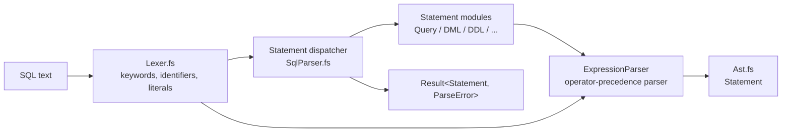

# Architecture

Design overview of the SQL parser: how the source is organised, how a statement
flows through the parsers, and which conventions the implementation follows.

---

## 1. Design principles

- **F# + [FParsec](https://www.quanttec.com/fparsec/)** — a scannerless,
  combinator-based parser; there is no separate token stream.
- **Functional-first** — recursion, immutability and composition over loops,
  mutation and statements; `[<TailCall>]` marks recursive loops.
- **Grammar-faithful** — [sql-2016-grammar.txt](../sql-2016-grammar.txt) (the
  SQL-2016 foundation grammar, ISO/IEC 9075-2:2016 clause numbering) is the
  design document. Comments cite the rule they implement as
  `// <clause> <rule name>` (enforced by `RuleNumberingTests.fs`), and the parser
  is as strict as the standard — see [trade-off.md](trade-off.md).
- **Parse-only, errors as values** — the library returns an AST
  (`Result<Statement, ParseError>`); it performs no name resolution, type
  checking or evaluation, so shape-based ambiguity is resolved heuristically,
  and it never throws for malformed input.

## 2. Parse pipeline

A single FParsec pass: `Lexer.fs` produces character-level tokens; the statement
modules (§4) parse clauses and delegate `<value expression>`s to the
`OperatorPrecedenceParser` (`opp`) in `ExpressionParser.fs`, which consumes the
§8 `<predicate>` chain from `PredicateParser.fs`. `runParser` turns FParsec's
`Failure` into `ParseError(message, Position)` and `Success` into `Ok`; both
entry points consume leading whitespace and require `eof`, so trailing garbage
is an error.

## 3. Entry points

Two public functions, both requiring the trailing `<semicolon>`:

| Function | Grammar rule | Accepts |
|----------|--------------|---------|
| `SqlParser.parse` | 22.1 `<direct SQL statement>` | The directly executable families: `<direct SQL data statement>` (searched `DELETE`, `SELECT`, `INSERT`, searched `UPDATE`, `TRUNCATE`, `MERGE`, `<temporary table declaration>`, `WITH ... <query>`), `<SQL schema statement>`, `<SQL transaction statement>`, `<SQL connection statement>`, `<SQL session statement>`. A bare `SELECT`/`WITH` is a 22.2 `<cursor specification>`, so it may carry a 14.3 `<updatability clause>`. |
| `SqlParser.parseStatement` | 13.4 `<SQL procedure statement>` | The `<SQL executable statement>` families: schema, `<SQL data statement>` (`OPEN`/`FETCH`/`CLOSE`, `SELECT ... INTO`, `FREE`/`HOLD LOCATOR`, positioned and searched DML), `CALL`/`RETURN`, transaction, connection, session, `GET DIAGNOSTICS`, and all dynamic-SQL statements. Excludes `DECLARE CURSOR` (14.1, an SQL-client module statement), `<temporary table declaration>` (14.16), multi-row `SELECT` and `WITH` — those are 22.1 forms. |

The two entry points are exact for their clauses — neither is a superset of
the other: `parse` rejects positioned `UPDATE` (14.13) / `DELETE` (14.8) via
`pSearchedUpdateStatement` / `pSearchedDeleteStatement`, while `parseStatement`
rejects the 22.x query forms; both omit 22.1's `<direct implementation-defined
statement>`. The omitted-target DML forms (20.25/20.27) are *preparable* statements —
the text handed to PREPARE — so both entry points reject them, while the DML parsers
keep the form for a future preparable-statement surface. `pStatement` (wired to
`parseStatement`, routine bodies and triggers) is therefore strict 13.4.
See [README.md](../README.md#usage).

## 4. Module map

F# compiles define-before-use, so modules are ordered leaf-first (shared
low-level parsers first, the dispatcher last) in `SqlParser/SqlParser.fsproj`:

| File | Grammar sections | Responsibility |
|------|------------------|----------------|
| `Ast.fs` | — | All AST types (`Statement`, `Expression`, `DataType`, …). No parsers. |
| `Lexer.fs` | §5, 10.1, 10.5 | Reserved words, whitespace/comments, identifiers, literals, operators, terminal characters, interval qualifiers, `<character set specification>`. |
| `ExpressionParser.fs` | §6, §7/§8 fragments, §10 | Operator-precedence parser, routine invocation, subqueries, row patterns, JSON functions, `<data type>` family, shared `<scope clause>`/`pMethodKind`. |
| `QueryParser.fs` | §6.10, §7, 10.10 | `<query expression>`, `SELECT`, table/join references, windows, CTEs, `MATCH_RECOGNIZE`. |
| `PredicateParser.fs` | §8 | `<predicate>` postfix chain (`BETWEEN`/`IN`/`LIKE`/`SIMILAR TO`/`IS …`) and the standalone `EXISTS`/`UNIQUE`/`JSON_EXISTS`/period predicates. |
| `SchemaParser.fs` | §11 | Schema definition/manipulation (`CREATE`/`ALTER`/`DROP`) including user-defined types (`CREATE`/`ALTER TYPE`, 11.51–11.53), plus `CREATE PROCEDURE`/`FUNCTION`/`METHOD`/`TRIGGER` (11.49/11.60/11.61); `DROP ROLE` (12.6) is a branch of the `DROP` dispatcher. |
| `AccessControlParser.fs` | §12 | `GRANT`/`REVOKE` (privileges and roles) and `CREATE ROLE` (12.2–12.5, 12.7). |
| `DataManipulationParser.fs` | §14 | The whole of §14: DML (`INSERT`, `UPDATE`, `DELETE`, `MERGE`, `TRUNCATE`) plus the cursor/locator statements (`DECLARE CURSOR` — parsed, but no entry point exposes 14.1 — `OPEN`/`FETCH`/`CLOSE`, `SELECT ... INTO`, `<temporary table declaration>`, `USING`/`INTO` clauses). |
| `ControlParser.fs` | §16, 10.4 | `CALL`, `RETURN`, plus the `<SQL argument>` / `<SQL argument list>` parsers consumed by §6's routine and method invocations. |
| `TransactionParser.fs` | §17 | `START TRANSACTION`, `COMMIT`, `ROLLBACK`, `SAVEPOINT`, `SET TRANSACTION`, `SET CONSTRAINTS`. |
| `ConnectionParser.fs` | §18 | `CONNECT`, `SET CONNECTION`, `DISCONNECT`. |
| `SessionParser.fs` | §19 | `SET ROLE`, `SET SESSION`, `SET SCHEMA`, `SET TIME ZONE`, … |
| `DynamicParser.fs` | §20 | `PREPARE`, `EXECUTE`, descriptors, dynamic cursors. |
| `DiagnosticsParser.fs` | §23 | `GET DIAGNOSTICS`. |
| `SqlParser.fs` | §22 | Top-level dispatchers, forward-reference wiring, public `parse`/`parseStatement`. |

Clause numbers stay roughly ascending, but dependencies win: §8 compiles after
§7 (it needs `ExpressionParser` parsers and the `pQuery` ref); §12 needs
`SchemaParser`'s `pSpecificRoutineDesignator` (10.6) and `pDropBehavior` (11.2);
`DataManipulationParser.fs` owns `pInputUsingClause`/`pOutputUsingClause`, which
`pOpenStatement` needs before `DynamicParser.fs` compiles.

## 5. Forward references and wiring

Mutually recursive rules are resolved with `createParserForwardedToRef`: a
forwarding parser plus a `…Ref` cell assigned once every participant is defined.
Most refs are wired where their target is defined (see the table); the three
§6-consumed predicate refs and `pDataChangeStatementRef` are wired in
`SqlParser.fs` instead, so the target module's initialiser is forced to run
before the first parse.

| Forward reference | Declared in | Wired to | Why |
|-------------------|-------------|----------|-----|
| `pStatement` / `pStatementRef` | `SchemaParser.fs` | the 13.4 statement `choice` (`SqlParser.fs`) | First module that needs "any statement" — routine bodies (11.60), triggers (11.49); `parseStatement` reuses the ref. Strict 13.4: no `DECLARE CURSOR`, temp table, multi-row `SELECT` or `WITH`. |
| `pDataChangeStatementRef` | `QueryParser.fs` | the DML parsers (`SqlParser.fs`) | `<data change delta table>` (7.6) needs §14, compiled later. |
| `pPredicateRef`, `pPredicateNoBooleanTestRef`, `pWhenOperandPart2Ref` | `ExpressionParser.fs` | `PredicateParser` (§8) (`SqlParser.fs`) | §6.3/§6.39/§6.12 consume §8 before `PredicateParser.fs` compiles: the full 8.1 chain, the no-6.39-test variant for non-`<boolean primary>` operands, and 6.12's part-2 list (`pBooleanTestPart2` itself lives in `ExpressionParser.fs`). |
| `pPredicatePrimaryRef` | `ExpressionParser.fs` | `PredicateParser` (§8) (`PredicateParser.fs` itself) | §6.3 needs the 8.9/8.10/8.11/8.20/8.23 atoms bundled in `pPredicatePrimary`; wired last in its defining module. |
| `pQueryRef` | `ExpressionParser.fs` | `pQueryExpression` (`QueryParser.fs`) | Scalar and quantified subqueries (6.29). |
| `pWindowNameOrSpecification`, `pSortSpecification` | `ExpressionParser.fs` | the 6.10 / 10.10 parsers (`QueryParser.fs`) | The 10.4 `<table argument>` ordering list, the 10.9 `WITHIN GROUP` body and the 10.11 `JSON_ARRAYAGG` body. |
| `pSqlArgumentList`, `pSqlArgumentListBody` | `ExpressionParser.fs` | the 10.4 parsers (`ControlParser.fs`) | `<routine invocation>` bodies and the 6.17–6.21 method/new/dereference postfixes. |
| `pExpression`, `pNonBooleanValueExpression` | `ExpressionParser.fs` | the `opp` variants (same module) | Used before `opp` is complete; the boolean-free variant keeps JSON slots and `<point in time>` (6.35) from consuming `AND`/`OR`. |
| `pDataType`, `pDatetimeValueExpression` | `ExpressionParser.fs` | the 6.1 / 6.35 parsers (same module) | `CAST`, JSON `RETURNING` and collection element types; the 6.37 interval alternative. |
| `pNumericValueExpression` | `ExpressionParser.fs` | `oppNumeric.ExpressionParser` (same module) | Breaks the `pValueExpressionPrimaryImpl → pArrayElementReference → pNumericValueExpression` cycle. |
| `pMultisetValueExpression`, `pBooleanFactor` | `ExpressionParser.fs` | same module | 6.44 `SET (...)` is itself a `<value expression primary>`; 6.39 `[ NOT ] <boolean test>` is left-recursive. |
| `pRowPattern`, `pTableReference`, `pQueryExpressionBody`, `pGroupingElement`, `pJsonTableColumnsClause`, `pJsonTablePlan` | `QueryParser.fs` | same module | Left-recursive §7 rules: row patterns (7.9), parenthesised `<joined table>`s, `UNION`/`EXCEPT` bodies, nested `GROUPING SETS`, `JSON_TABLE` columns/plans. |

**Never read `.Value` at module-initialisation time** — it holds FParsec's dummy
parser until it is assigned. Reference the forwarding *parser* instead.

## 6. AST design (`Ast.fs`)

- **One namespace, one file.** Every type lives in `namespace SqlParser` in
  `Ast.fs`, so parsers can pattern-match without opening a types module.
- **Position tracking.** `Position = { Line: int64; Column: int64 }`. `Statement`,
  `Expression` and `TableSource` carry a `Pos`, attached by `withStmtPosition` /
  `withExprPosition` / `withTablePosition` where the node starts; other types are
  unpositioned.
- **One big recursive group.** `DataType` (6.1) and `ExpressionKind` open an
  `and`-chain that includes nearly every AST type; new types that reference
  `Expression` must join it with `and`.
- **DUs first, names mirror the grammar.** Domain choices are modelled as DUs
  (`Query`, `TableSourceKind`, `AlterTableAction`, …) for exhaustiveness; parsers
  and AST cases mirror the non-terminals they implement.
- **`option` vs `bool`; fields over cases.** An absent clause is `None`; a
  two-way choice with a required operand is usually a `bool` (`true` =
  `CASCADE`/`ENFORCED`/`USER`), matching `<drop behavior>` and friends. Records
  gain `… : X option` fields rather than new DU cases, unless the alternatives
  are structurally different.

> ⚠️ `Expression`, `TableSource` and `Statement` all have `Kind` + `Pos` fields.
> Unannotated record literals can be inferred to the wrong one; see
> [gotchas.md](gotchas.md).

## 7. Keywords and reserved words

- `Lexer.reservedWords` is the 5.2 `<reserved word>` set; `pRegularIdentifier`
  rejects reserved words, while delimited identifiers (`"…"`, Unicode) do not.
- `pKeyword s` matches any keyword case-insensitively, requires a non-identifier
  character after it (`SYSTEM` ≠ `SYSTEM_TIME`) and consumes trailing whitespace.
  It works for reserved *and* non-reserved words — reservedness only constrains
  identifiers.
- Because keyword dispatch cannot rely on reservedness, alternative order is
  load-bearing (`ALTER TYPE` before `ALTER ROUTINE`, `DROP TYPE` before
  `DROP ROUTINE`, …); see [gotchas.md](gotchas.md).
- Routine invocation splits into a reserved-keyword **whitelist**
  (`functionKeywords` / `pReservedFunctionName`) and non-reserved/delimited
  identifiers (`pRoutineName`). Reserved words that start dedicated constructs
  (`EXISTS`, `UNIQUE`, `VALUE_OF`, `PERIOD`, …) stay off the whitelist, so they
  cannot silently degrade to a generic `FunctionCall`.
- Closed enumerations (diagnostics/descriptor item names, `<language name>`,
  `<parameter style>`) use explicit `choice [ pKeyword "…" ]` lists, never
  `pIdentifierRaw`, which would also accept `ALL`/`SELECT`/….

## 8. Error handling and validation

- **No exceptions for bad input.** `runParser` converts FParsec results to
  `Result<Statement, ParseError>` (with a try/with safety net); `ParseError`
  carries the message and position.
- **Semantic guards run inside the parser** where the grammar demands more than
  syntax — `pSearchedUpdateStatement`/`pSearchedDeleteStatement` (22.1), the
  omitted-target rejection at both entry points (20.25/20.27 are preparable-only),
  `validateRoutine` (11.60), the lexer's date/interval value checks — using `>>=` plus
  `fail`, because `|>>` cannot fail.
- **Backtracking.** A `choice` alternative that has consumed input is not retried
  by `<|>`, so optional or speculative prefixes are wrapped in `attempt`;
  wrapping too little is a common bug — see [gotchas.md](gotchas.md).

## 9. Grammar coverage

| Section | ✅ | ◐ | ✗ | ⊘ | Total |
|---------|--:|--:|--:|--:|------:|
| §5 Lexical elements | 4 | 0 | 0 | 0 | 4 |
| §6 Scalar expressions | 45 | 0 | 0 | 0 | 45 |
| §7 Query expressions | 19 | 0 | 0 | 0 | 19 |
| §8 Predicates | 23 | 0 | 0 | 0 | 23 |
| §9 Additional common rules | 0 | 0 | 3 | 0 | 3 |
| §10 Additional common elements | 14 | 0 | 0 | 0 | 14 |
| §11 Schema definition and manipulation | 74 | 0 | 0 | 0 | 74 |
| §12 Access control | 7 | 0 | 0 | 0 | 7 |
| §13 SQL-client modules | 0 | 0 | 3 | 1 | 4 |
| §14 Data manipulation | 18 | 0 | 0 | 0 | 18 |
| §16 Control statements | 2 | 0 | 0 | 0 | 2 |
| §17 Transaction management | 8 | 0 | 0 | 0 | 8 |
| §18 Connection management | 3 | 0 | 0 | 0 | 3 |
| §19 Session management | 10 | 0 | 0 | 0 | 10 |
| §20 Dynamic SQL | 26 | 0 | 0 | 1 | 27 |
| §21 Embedded SQL | 0 | 0 | 0 | 9 | 9 |
| §22 Direct invocation of SQL | 2 | 0 | 0 | 0 | 2 |
| §23 Diagnostics management | 1 | 0 | 0 | 0 | 1 |
| **Total** | **256** | **0** | **6** | **11** | **273** |

- **Missing (✗):** §9.38/9.39/9.44 (SQL/JSON path language and datetime
  templates — heading-only sections with no `<…>` productions) and §13.1–13.3
  (SQL-client module definition; not applicable to a library).
- **N/A (⊘):** §13.4, §20.26, and all of §21 (embedded SQL host programs).
- **Over-permissive:** none recorded — accepted-but-not-standard constructs are
  limited to the deliberate deviations in [trade-off.md](trade-off.md).
- A rule name absent from the source does **not** imply it is unimplemented — it
  may be a sub-rule of a cited parent production.

## 10. Supported SQL features

- **Querying** — `SELECT` clauses (`WHERE`/`GROUP BY`/`HAVING`/`WINDOW`/`ORDER BY`/
  `OFFSET`/`FETCH` with `PERCENT`/`WITH TIES`), set operations, window functions,
  `WITH [RECURSIVE]` CTEs (`SEARCH`/`CYCLE`), row value constructors, all
  select-list asterisk forms, and the table references (`ONLY (t)`,
  `FOR SYSTEM_TIME`, `UNNEST`, `LATERAL`, `TABLESAMPLE`, `JSON_TABLE`,
  `MATCH_RECOGNIZE`, data-change delta tables).
- **DML** — `INSERT` (values / query / `DEFAULT VALUES`), searched and positioned
  `UPDATE`/`DELETE` (`ONLY (t)`, `FOR PORTION OF`), `MERGE`, `TRUNCATE`.
- **Cursors & locators** — declared and dynamic cursors, `OPEN`/`FETCH`/`CLOSE`,
  `SELECT ... INTO`, local temporary tables, `FREE`/`HOLD LOCATOR`.
- **DDL** — `CREATE`/`ALTER`/`DROP` for tables, views, schemas, domains, character
  sets, collations, translations, assertions, casts, orderings, transforms, types,
  sequences, routines and triggers, with the full constraint and
  `<alter table action>` sets; `GRANT`/`REVOKE` over every 12.3 object kind.
- **Dynamic SQL, diagnostics & sessions** — `PREPARE`/`EXECUTE`/`EXECUTE
  IMMEDIATE`/`DESCRIBE`, descriptors, dynamic cursors, `PIPE ROW`;
  `GET DIAGNOSTICS`; `CONNECT`/`SET CONNECTION`/`DISCONNECT`; the `SET` session
  statements.
- **Transactions** — `START TRANSACTION`, `COMMIT`/`ROLLBACK`, savepoints,
  `SET [LOCAL] TRANSACTION`, `SET CONSTRAINTS`.
- **Expressions & types** — the full operator set and the §8 predicates
  (`BETWEEN`, `IN`, `LIKE`, `SIMILAR TO`, `IS ...`, `MEMBER OF`, …); the
  standard function families — numeric, string (`SUBSTRING`, `TRIM`,
  `NORMALIZE`), regex, collection (`ARRAY`/`MULTISET`/`TABLE (query)`, `ELEMENT`,
  `SET`), JSON (`JSON_VALUE`, `JSON_QUERY`, `JSON_OBJECT`, `JSON_ARRAY`, the
  aggregates) and datetime (`AT TIME ZONE`/`AT LOCAL`); the full type system
  (`INTERVAL`, `ARRAY`, `REF(...)`, `ROW`, nested collections); all literal
  forms.

## 11. Testing

- **xUnit v3** (`dotnet test`): one test file per source module, in the same
  compile order as `SqlParser.fsproj`, so each file exercises only the module it
  is named after.
- **`RuleNumberingTests.fs`** validates that every `// <clause> <rule name>`
  comment cites a clause that actually defines (or mentions) that rule in
  `sql-2016-grammar.txt`.

## 12. Related documents

| Document | Contents |
|----------|----------|
| [trade-off.md](trade-off.md) | Design decisions and the alternatives rejected. |
| [gotchas.md](gotchas.md) | Recurring F#/FParsec/grammar pitfalls. |
