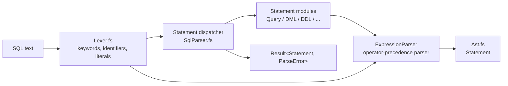

# Architecture

Design overview of the SQL parser: how the source is organised, how a statement
flows through the parsers, and which conventions the implementation follows.

---

## 1. Design principles

- **F# + [FParsec](https://www.quanttec.com/fparsec/)** — a scannerless,
  combinator-based parser; no separate token stream.
- **Functional-first** — recursion, immutability and composition over loops and
  mutation; `[<TailCall>]` marks recursive loops.
- **Grammar-faithful** — [sql-2016-grammar.txt](../sql-2016-grammar.txt)
  (ISO/IEC 9075-2:2016 clause numbering) is the design document: definitions
  cite `// <clause> <rule name>` (enforced by `RuleNumberingTests.fs`) and
  follow ascending clause order where define-before-use allows (see
  [AGENTS.md](../AGENTS.md)). Deviations are recorded in
  [trade-off.md](trade-off.md).
- **Parse-only, errors as values** — the library returns
  `Result<Statement, ParseError>`; no name resolution, type checking or
  evaluation, and no exceptions for malformed input.

## 2. Parse pipeline

```mermaid
flowchart LR
    A["SQL text"] --> B["Lexer.fs<br/>keywords, identifiers, literals"]
    B --> C["Statement dispatcher<br/>SqlParser.fs"]
    C --> D["Statement modules<br/>Query / DML / DDL / ..."]
    D --> E["ExpressionParser<br/>operator-precedence parser"]
    B --> E
    E --> F["Ast.fs<br/>Statement"]
    C --> G["Result&lt;Statement, ParseError&gt;"]
```

A single FParsec pass: the statement modules (§4) delegate `<value expression>`s
to the `OperatorPrecedenceParser` (`opp`) in `ExpressionParser.fs`, which
consumes the §8 `<predicate>` chain from `PredicateParser.fs`. `runParser` maps
FParsec's `Failure` to `ParseError(message, Position)` and `Success` to `Ok`;
both entry points consume leading whitespace and require the trailing
`<semicolon>` and `eof`.

## 3. Entry points

Both functions require the trailing `<semicolon>`; the accepted statement lists
are in [README.md](../README.md#usage). Architectural points:

- `SqlParser.parse` (22.1 `<direct SQL statement>`) accepts the directly
  executable families; a bare `SELECT`/`WITH` is a 22.2 `<cursor specification>`,
  so it may carry a 14.3 `<updatability clause>`.
- `SqlParser.parseStatement` (13.4 `<SQL procedure statement>`) is wired to
  `pStatement` (routine bodies, triggers) and is strict 13.4: `DECLARE CURSOR`
  (14.1), `<temporary table declaration>` (14.16) and the 22.x query forms are
  reachable only through `parse`.
- Neither is a superset of the other: `parse` rejects positioned
  `UPDATE`/`DELETE` (`pSearchedUpdateStatement`/`pSearchedDeleteStatement`) and
  `parseStatement` rejects the 22.x query forms; both reject the preparable-only
  omitted-target DML forms (20.25/20.27) via `rejectOmittedTarget`, while the
  DML parsers keep the form for a future preparable-statement surface.

## 4. Module map

F# compiles define-before-use, so modules are ordered leaf-first (shared
low-level parsers first, the dispatcher last) in `SqlParser/SqlParser.fsproj`:

| File | Grammar sections | Responsibility |
|------|------------------|----------------|
| `Ast.fs` | — | All AST types (`Statement`, `Expression`, `DataType`, …). No parsers. |
| `Lexer.fs` | §5, 10.1, 10.5 | Reserved words, whitespace/comments, identifiers, literals, operators, terminal characters, interval qualifiers, `<character set specification>`. |
| `ExpressionParser.fs` | §6, §7/§8 fragments, §10 | Operator-precedence parser, routine invocation, subqueries, row patterns, JSON functions, `<data type>` family, shared `<scope clause>`/`pMethodKind`, 5.4 name-arity parsers. |
| `QueryParser.fs` | §6.10, §7, 10.10 | `<query expression>`, `SELECT`, table/join references, windows, CTEs, `MATCH_RECOGNIZE`. |
| `PredicateParser.fs` | §8 | `<predicate>` postfix chain (`BETWEEN`/`IN`/`LIKE`/`SIMILAR TO`/`IS …`) and the standalone `EXISTS`/`UNIQUE`/`JSON_EXISTS`/period predicates. |
| `SchemaParser.fs` | §11 | Schema definition/manipulation (`CREATE`/`ALTER`/`DROP`) including user-defined types (11.51–11.53) and `CREATE PROCEDURE`/`FUNCTION`/`METHOD`/`TRIGGER` (11.49/11.60/11.61); `DROP ROLE` (12.6) is a branch of the `DROP` dispatcher. |
| `AccessControlParser.fs` | §12 | `GRANT`/`REVOKE` (privileges and roles) and `CREATE ROLE` (12.2–12.5, 12.7). |
| `DataManipulationParser.fs` | §14 | The whole of §14: DML (`INSERT`, `UPDATE`, `DELETE`, `MERGE`, `TRUNCATE`), the 14.3 `<cursor specification>` with its `<updatability clause>`, cursors/locators (`DECLARE CURSOR` — parsed but exposed by no entry point —, `OPEN`/`FETCH`/`CLOSE`, `SELECT ... INTO`, `<temporary table declaration>`, `USING`/`INTO` clauses). |
| `ControlParser.fs` | §16, 10.4 | `CALL`, `RETURN`, plus the `<SQL argument>` / `<SQL argument list>` parsers consumed by §6's routine and method invocations. |
| `TransactionParser.fs` | §17 | `START TRANSACTION`, `COMMIT`, `ROLLBACK`, `SAVEPOINT`, `SET TRANSACTION`, `SET CONSTRAINTS`. |
| `ConnectionParser.fs` | §18 | `CONNECT`, `SET CONNECTION`, `DISCONNECT`. |
| `SessionParser.fs` | §19 | `SET ROLE`, `SET SESSION`, `SET SCHEMA`, `SET TIME ZONE`, … |
| `DynamicParser.fs` | §20 | `PREPARE`, `EXECUTE`, descriptors, dynamic cursors. |
| `DiagnosticsParser.fs` | §23 | `GET DIAGNOSTICS`. |
| `SqlParser.fs` | §22 | Top-level dispatchers, forward-reference wiring (§5), public `parse`/`parseStatement`. |

Clause order yields to dependencies: §8 compiles after §7 (it needs
`ExpressionParser` parsers and the `pQuery` ref); §12 needs `SchemaParser`'s
`pSpecificRoutineDesignator` (10.6) and `pDropBehavior` (11.2);
`DynamicParser.fs` consumes the `USING` clauses that `DataManipulationParser.fs`
owns.

## 5. Forward references and wiring

Mutually recursive rules are resolved with `createParserForwardedToRef`: a
forwarding parser plus a `…Ref` cell assigned once every participant is defined.
Most refs are wired where their target is defined; `SqlParser.fs` wires
`pStatementRef`, `pDataChangeStatementRef` and the three §8 predicate refs
(`pPredicateRef`, `pPredicateNoBooleanTestRef`, `pWhenOperandPart2Ref`).

| Forward reference | Declared in | Wired to | Why |
|-------------------|-------------|----------|-----|
| `pStatement` / `pStatementRef` | `SchemaParser.fs` | the 13.4 statement `choice` (`SqlParser.fs`) | First module that needs "any statement" — routine bodies (11.60), triggers (11.49). |
| `pDataChangeStatementRef` | `QueryParser.fs` | the DML parsers (`SqlParser.fs`) | `<data change delta table>` (7.6) needs §14, compiled later. |
| `pPredicateRef`, `pPredicateNoBooleanTestRef`, `pWhenOperandPart2Ref` | `ExpressionParser.fs` | `PredicateParser` (§8) (`SqlParser.fs`) | §6.3/§6.39/§6.12 consume §8 before `PredicateParser.fs` compiles. |
| `pPredicatePrimaryRef` | `ExpressionParser.fs` | `pPredicatePrimary` (`PredicateParser.fs`) | §6.3 needs the 8.9/8.10/8.11/8.20/8.23 atoms; wired last in its target module. |
| `pQueryRef` | `ExpressionParser.fs` | `pQueryExpression` (`QueryParser.fs`) | Scalar and quantified subqueries (6.29). |
| `pWindowNameOrSpecification`, `pSortSpecification` | `ExpressionParser.fs` | the 6.10 / 10.10 parsers (`QueryParser.fs`) | The 10.4 `<table argument>` ordering list, 10.9 `WITHIN GROUP`, 10.11 `JSON_ARRAYAGG`. |
| `pSqlArgumentList`, `pSqlArgumentListBody` | `ExpressionParser.fs` | the 10.4 parsers (`ControlParser.fs`) | `<routine invocation>` bodies and the 6.17–6.21 method/new/dereference postfixes. |
| `pDataType`, `pExpression`, `pExtractSource`, `pDatetimeValueExpression`, `pMultisetValueExpression`, `pNonBooleanValueExpression`, `pNumericValueExpression` | `ExpressionParser.fs` | same module | Wired once their targets exist (`pExpression` after `opp`, `pExtractSource` after 6.35/6.37); `pNumericValueExpression` breaks the `pValueExpressionPrimaryImpl → pArrayElementReference` cycle; the boolean-free variant keeps JSON slots and `<point in time>` (6.35) from consuming `AND`/`OR`. |
| `pRowPattern`, `pTableReference`, `pQueryExpressionBody`, `pGroupingElement`, `pJsonTableColumnsClause`, `pJsonTablePlan` | `QueryParser.fs` | same module | Left-recursive §7 rules: row patterns (7.9), parenthesised `<joined table>`s, `UNION`/`EXCEPT` bodies, nested `GROUPING SETS`, `JSON_TABLE` columns/plans. |

**Never read `.Value` at module-initialisation time** — it holds FParsec's dummy
parser until assigned. Reference the forwarding *parser* instead.

## 6. AST design (`Ast.fs`)

- **One namespace, one file.** Every type lives in `namespace SqlParser` in
  `Ast.fs`, so parsers pattern-match without opening a types module.
- **Position tracking.** `Statement`, `Expression` and `TableSource` carry a
  `Pos` (`{ Line: int64; Column: int64 }`), attached by `withStmtPosition` /
  `withExprPosition` / `withTablePosition`; other types are unpositioned.
- **One big recursive group.** `DataType` (6.1) and `ExpressionKind` open an
  `and`-chain that includes nearly every AST type; new types referencing
  `Expression` must join it with `and`.
- **DUs first, names mirror the grammar.** Domain choices are DUs
  (`Query`, `TableSourceKind`, `AlterTableAction`, …) for exhaustiveness.
- **`option` vs `bool`; fields over cases.** An absent clause is `None`; a
  two-way choice with a required operand is usually a `bool` (`CASCADE`,
  `ENFORCED`, `USER`, …). Records gain `… : X option` fields rather than new DU
  cases, unless the alternatives are structurally different.

> ⚠️ `Expression`, `TableSource` and `Statement` all have `Kind` + `Pos` fields.
> Unannotated record literals can be inferred to the wrong one; see
> [gotchas.md](gotchas.md).

## 7. Keywords and reserved words

- `Lexer.reservedWords` is the 5.2 `<reserved word>` set; `pRegularIdentifier`
  rejects reserved words, delimited identifiers (`"…"`, Unicode) do not.
- `pKeyword s` matches keywords case-insensitively, requires a non-identifier
  character after them (`SYSTEM` ≠ `SYSTEM_TIME`) and consumes trailing
  whitespace. It works for reserved *and* non-reserved words, so keyword
  dispatch cannot rely on reservedness and alternative order is load-bearing
  (`ALTER TYPE` before `ALTER ROUTINE`, …); see [gotchas.md](gotchas.md).
- Routine invocation splits into a reserved-keyword whitelist
  (`functionKeywords` / `pReservedFunctionName`) and non-reserved or delimited
  identifiers (`pRoutineName`); reserved words that start dedicated constructs
  (`EXISTS`, `UNIQUE`, `VALUE_OF`, `PERIOD`, …) stay off the whitelist so they
  cannot silently degrade to a generic `FunctionCall`.
- Closed enumerations (diagnostics/descriptor item names, `<language name>`,
  `<parameter style>`) use explicit `choice [ pKeyword "…" ]` lists, never
  `pIdentifierRaw`, which would also accept `ALL`/`SELECT`/….

## 8. Error handling and validation

- **No exceptions for bad input.** `runParser` converts FParsec results to
  `Result<Statement, ParseError>` (with a try/with safety net).
- **Semantic guards run inside the parser** where the grammar demands more than
  syntax (searched-only entry points, `rejectOmittedTarget` for 20.25/20.27,
  `validateRoutine` for 11.60, the lexer's date/interval checks), using `>>=`
  plus `fail`, because `|>>` cannot fail.
- **Backtracking.** A `choice` alternative that has consumed input is not
  retried by `<|>`, so optional or speculative prefixes are wrapped in
  `attempt`; wrapping too little is a common bug — see [gotchas.md](gotchas.md).

## 9. Grammar coverage

| Section | ✅ | ✗ | ⊘ | Total |
|---------|--:|--:|--:|------:|
| §5 Lexical elements | 4 | 0 | 0 | 4 |
| §6 Scalar expressions | 45 | 0 | 0 | 45 |
| §7 Query expressions | 19 | 0 | 0 | 19 |
| §8 Predicates | 23 | 0 | 0 | 23 |
| §9 Additional common rules | 0 | 3 | 0 | 3 |
| §10 Additional common elements | 14 | 0 | 0 | 14 |
| §11 Schema definition and manipulation | 74 | 0 | 0 | 74 |
| §12 Access control | 7 | 0 | 0 | 7 |
| §13 SQL-client modules | 0 | 3 | 1 | 4 |
| §14 Data manipulation | 18 | 0 | 0 | 18 |
| §16 Control statements | 2 | 0 | 0 | 2 |
| §17 Transaction management | 8 | 0 | 0 | 8 |
| §18 Connection management | 3 | 0 | 0 | 3 |
| §19 Session management | 10 | 0 | 0 | 10 |
| §20 Dynamic SQL | 27 | 0 | 0 | 27 |
| §21 Embedded SQL | 0 | 0 | 9 | 9 |
| §22 Direct invocation of SQL | 2 | 0 | 0 | 2 |
| §23 Diagnostics management | 1 | 0 | 0 | 1 |
| **Total** | **256** | **6** | **11** | **273** |

- **Missing (✗):** §9.38/9.39/9.44 (SQL/JSON path language and datetime
  templates — heading-only sections) and §13.1–13.3 (SQL-client module
  definition; not applicable to a library).
- **N/A (⊘):** §13.4 and all of §21 (embedded SQL host programs).
- **Over-permissive:** none — accepted-but-not-standard constructs are limited
  to the deliberate deviations in [trade-off.md](trade-off.md).
- Clause-level counts are an inventory summary, not an alternative-level
  conformance matrix; a rule name absent from the source does not imply it is
  unimplemented (it may be a sub-rule of a cited parent production).
- **5.4 name arities.** The name productions have three different arities, so
  `pSchemaQualifiedNameExpression` (three parts) is *not* the default.
  `ExpressionParser.fs` exposes `pIdentifierNameExpression` (one part),
  `pSchemaNameExpression` / `pCharacterSetNameExpression` (two) and
  `pLocalQualifiedNameExpression` (two, `MODULE` only) for the narrower slots;
  see [trade-off.md](trade-off.md).

## 10. Supported SQL features

- **Querying** — `SELECT` clauses (`WHERE`/`GROUP BY`/`HAVING`/`WINDOW`/
  `ORDER BY`/`OFFSET`/`FETCH`), set operations, window functions,
  `WITH [RECURSIVE]` CTEs (`SEARCH`/`CYCLE`), row value constructors, all
  select-list asterisk forms, and the table references (`ONLY (t)`,
  `FOR SYSTEM_TIME`, `UNNEST`, `LATERAL`, `TABLESAMPLE`, `JSON_TABLE`,
  `MATCH_RECOGNIZE`, data-change delta tables).
- **DML & cursors** — `INSERT` (values / query / `DEFAULT VALUES`), searched and
  positioned `UPDATE`/`DELETE` (`ONLY (t)`, `FOR PORTION OF`), `MERGE`,
  `TRUNCATE`; declared and dynamic cursors, `OPEN`/`FETCH`/`CLOSE`,
  `SELECT ... INTO`, local temporary tables, `FREE`/`HOLD LOCATOR`.
- **DDL** — `CREATE`/`ALTER`/`DROP` for tables, views, schemas, domains,
  character sets, collations, translations, assertions, casts, orderings,
  transforms, types, sequences, routines and triggers, with the full constraint
  and `<alter table action>` sets; `GRANT`/`REVOKE` over every 12.3 object kind.
- **Dynamic SQL, diagnostics, sessions & transactions** — `PREPARE`/`EXECUTE`/
  `EXECUTE IMMEDIATE`/`DESCRIBE`, descriptors, dynamic cursors, `PIPE ROW`;
  `GET DIAGNOSTICS`; `CONNECT`/`SET CONNECTION`/`DISCONNECT`; the `SET` session
  statements; `START TRANSACTION`, `COMMIT`/`ROLLBACK`, savepoints,
  `SET [LOCAL] TRANSACTION`, `SET CONSTRAINTS`.
- **Expressions & types** — the full operator set and the §8 predicates; the
  standard function families — numeric, string, regex, collection
  (`ARRAY`/`MULTISET`/`TABLE (query)`, `ELEMENT`, `SET`), JSON (`JSON_VALUE`,
  `JSON_QUERY`, `JSON_OBJECT`, `JSON_ARRAY`, the aggregates) and datetime
  (`AT TIME ZONE`/`AT LOCAL`); the full type system (`INTERVAL`, `ARRAY`,
  `REF(...)`, `ROW`, nested collections); all literal forms.

## 11. Testing

- **xUnit v3** (`dotnet test`) — one test file per source module, in
  `SqlParser.fsproj` compile order.
- **`RuleNumberingTests.fs`** — every `// <clause> <rule name>` comment must
  cite a clause that defines (or mentions) that rule in `sql-2016-grammar.txt`.

## 12. Related documents

[trade-off.md](trade-off.md) — design decisions and rejected alternatives;
[gotchas.md](gotchas.md) — recurring F#/FParsec/grammar pitfalls. Full list:
[README.md](../README.md#documentation).
